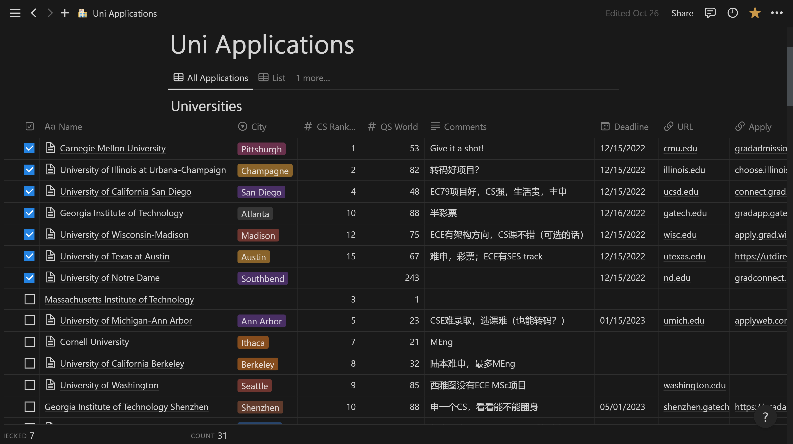

# \[US\]-19-黄冠超 MS CSE @ ND

> 没时间听我废话？直接看[申请结果](#申请结果)
>
> 如果我的经验分享有帮助到你，不妨[请我喝杯咖啡](#请我喝杯咖啡)

## 更新记录

- 2023-03-21：更新 UCSD 拒信，少量优化
- 2023-02-19：首次上传

## 为什么要出国？

- 拓宽文化视野
- 更好的教育质量与学习环境
- 更短的学制（Master项目）
- 国外的就业前景，乃至于（对许多人而言）最终移民的机会
- 避免无用功
  - 参加推免需要准备竞赛、课外活动、科研等，且其对GPA的容错率过低，同时在同系同学之间营造出相互倾轧竞争的不良风气
  - 参加考研需要花费大量时间备考，其竞争之激烈程度自不必说，而这部分投入除了可以用来换取入学资格之外，几乎没有太多其他的用处。

诚然，出国留学的缺点、难点也有许多，如外语、费用、安全问题、跨文化交流问题等等。但综合来说，留学依然是我心目中大多数人的最优选项。

## 申请目标

> [!ATTENTION|label:明确目标]
> 不管你的软硬件条件如何，希望申请哪个地区、哪一个层次的院校、哪一个专业，都应首先了解自己希望借此最终达成的目标。

- 转码 => ECE
  - 由于 CSE 专业的申请竞争过于激烈\*，且我本科并 CSE 专业，因此选择申请 ECE 项目。
  - 因此，我希望项目能提供偏向软件方面的课程选择。
  - 同时，我需要院校能提供较好的就业出路，故而地理位置、院校的行业声誉将成为重要的考虑因素。
  - 但请注意，我的分析并非是唯一的最优解，通过放弃院校排名\*\*来满足CSE专业也是非常值得考虑的选项。
- 找工 => Master
  - 我（暂时）对学术不甚感兴趣，因此选择了偏向就业导向的 Master 项目。
  - 学制较短的 Master of Engineering 项目不便于准备实习、找工作等\*\*\*，故而选择学制更长的 Master of Science 项目。

\* 唯一的例外是 University of Notre Dame，鉴于我与该校 CSE Department 千丝万缕的联系，我认为自己可以拿下该校的 MS CSE offer。

\*\* 我很大程度上是受到了*名校情结*的影响，才选择放弃CSE专业以追求更高的排名。

\*\*\* 因此放弃了 Cornell University。

## 基本背景

- 姓名: 黄冠超
- 专业: 微电子科学与工程
- 学术导师：（时间顺序）
  1. 深港微电子学院[余浩教授](https://faculty.sustech.edu.cn/yuh3/)
  2. 深港微电子学院[陈凯教授](https://faculty.sustech.edu.cn/chenk6/)
  3. 计算机科学与工程系[李卓钊助理教授](https://zhuozhaoli.github.io/)指导了我的毕业设计，但
  4. 深港微电子学院[陈全助理教授](https://faculty.sustech.edu.cn/chenq3/)是名义上的第一指导老师
- GPA：3.69/4.00，专业排名17/71（Top 25%）
- TOEFL：112/120
  | Listening | Speaking | Reading | Writing |
  | :-------: | :------: | :-----: | :-----: |
  |    30     |    26    |   28    |   28    |
- GRE：324/340
  | Verbal | Quant | Analytical Writing |
  | :----: | :---: | :----------------: |
  |  157   |  167  |        4.0         |
- 交流经历：University of Notre Dame [学期交换](https://ndi-sa.nd.edu/index.cfm?FuseAction=Programs.ViewProgramAngular&id=10124)，GPA 3.833/4.000
- 科研
  - University of Notre Dame CSE Department [暑研](https://cclnd.blogspot.com/2022/08/isure-project-visualizing-and-right.html)
  - 无其他科研经历
  - 无论文、专利等发表
- 竞赛/奖学金：聊胜于无
- 推荐信
  |       Institution        |            Department            |            Title             |                              Name                              |     Relation      |
  | :----------------------: | :------------------------------: | :--------------------------: | :------------------------------------------------------------: | :---------------: |
  |       南方科技大学       |          深港微电子学院          |          产学研教授          |         [陈凯](https://faculty.sustech.edu.cn/chenk6/)         |     学术导师      |
  | University of Notre Dame | Computer Science and Engineering | Ted H. McCourtney Professor  | [Peter Kogge](https://engineering.nd.edu/faculty/peter-kogge/) | Course Instructor |
  |            "             |                "                 | Associate Teaching Professor |            [Peter Bui](https://www3.nd.edu/~pbui/)             |         "         |

- 证书：二十余个网课证书，详见[我的 LinkedIn](https://www.linkedin.com/in/sghuang19/)

> [!TIP|label:我的B面|style:flat]
> 申请之外的我更有趣：喜欢音乐、读书、哲学、心理学和摄影，还能使长剑和军刀。醉心生产力和个人知识管理的数字花园园艺师，在消费电子展柜前流连忘返的极客。对了，还是个容易孤独的 [INFJ](https://www.16personalities.com/profiles/7c48aef917dde)，欢迎你和我[交朋友](#联系方式)。

## 申请结果

> [!NOTE|label:最终去向]
>
> Master of Science in Computer Science and Engineering, University of Notre Dame
>
> Wait, but [why](#决断)?

以下院校依照 [CS Ranking](http://csrankings.org/) 降序排列，录取结果截止2023年4月12日。

|                Institution                 | Program             |    Result    |  Date   |
| :----------------------------------------: | :------------------ | :----------: | :-----: |
|         Carnegie Mellon University         | MS ECE              |   Pending    |         |
| University of Illinois at Urbana-Champaign | MS ECE              | ~~Rejected~~ | Apr. 04 |
|     University of California San Diego     | MS ECE EC79         | ~~Rejected~~ | Mar. 17 |
|      Georgia Institute of Technology       | MS ECE              |   Pending    |         |
|     University of Wisconsin-Madison\*      | MS CS               | ~~Rejected~~ | Feb. 14 |
|                     "                      | MS ECE Research     | ~~Rejected~~ | Apr. 03 |
|                     "                      | MS ECE Professional |  *Admitted*  | Feb. 17 |
|       University of Texas at Austin        | MS ECE              |   Pending    |         |
|        University of Notre Dame\*\*        | MS CSE              |  *Admitted*  | Feb. 09 |

总计7所学校，9个项目；目前录取2所，被拒3所。

\* UW-Madison 可同时申请3个项目

\*\* 笔者在 University of Notre Dame 进行了学期交换与暑研，且两封推荐信都是该校CSE Dept.教授所写。

另有其他院校的出现在初步的选校清单上，但最终我没有进行申请。为帮助与我背景类似的同学选校，我同时也将这些院校及没有最终进行申请的原因列出。

|               Institution                |            Reason            |
| :--------------------------------------: | :--------------------------: |
|   University of California Los Angeles   | 申请难度大，且课程设计偏硬件 |
|      University of South California      |           费用高昂           |
|     University of Michigan-Ann Arbor     |         截止日期晚\*         |
|           Columbia University            |              "               |
|             Duke University              |              "               |
|         Northwestern University          |     已得到其他院校offer      |
| Georgia Institute of Technology Shenzhen |              "               |
|            Purdue University             |              "               |
|     University of California Irvine      |       （盲目）追求排名       |

\* 完成截止日期为12月15日的院校申请之后，便偷懒不想继续申请后续的学校了。

## 申请心得

### 工具

> [!WARNING|label:善假于物]
> Our mind is for **having** ideas, not for **holding** them. -- David Allen, *Getting Things Done*

申请工作并不艰难，只是较为繁琐。我主要使用了两个工具来辅助这一过程：[Notion](https://notion.so) 与 [TickTick](https://ticktick.com)（即[滴答清单](https://dida365.com)）。

网上已有很多资源介绍 Notion 的使用，这里不再赘述。申请过程要面对的是多个院校，而这些院校又都有相同的 attributes：院校的名称、是否最终选中进行申请、排名、地域、截止日期、官网、申请系统入口、对该项目的简单评论等，Notion 的**数据库**功能可以很好地组织此类结构化数据。上图所展示的就是我的申请“大本营”。我以列表形式将考察的所有学校列出，通过自定义的排序规则，按照 [CS Ranking](https://csranking.org) 和 [QS World](https://www.topuniversities.com/qs-world-university-rankings) 对它们进行降序排列，并将最终勾选中的院校置顶，所有信息都一目了然。表格中的每一个条目都是一个笔记，点击打开，可以看到我对每所学校所做的更细致的研究。

正式进入申请阶段后，要面临的就是纷繁复杂的表格填写、材料提交等，利用好任务管理工具来帮助我们追踪进度可以极大地减少 FOMO (= Fear of Missing Out) 给我们带来的焦虑。上图就是我在 TickTick 中的“战时指挥所”，通过将各个类型的任务、院校划分进不同的 section，并且利用 sub-task 与 due date 来跟踪发出推荐信邀请、确认收到推荐信、送分等任务的完成情况以及项目的截止日期。在这一套系统的帮助之下，我最终幸运地没有错过任何一个截止日——当然，拖延依旧是避免不了的。

### 文书

> [!TIP|label:文章憎命达]
> What is my Job on the planet with a capital J? -- Jon Kabat-Zinn, *Wherever You Go, There You Are*
>
> 我相信写出好的 Statement of Purpose 的最佳方法，就是不断地自我探寻、丰富、打磨自己的 Purpose。我们永远无法写出未曾经历和反思过的文字——当然，你可以选择让中介代笔，但这不是我的选项。

这里着重强调 Statement of Purpose 的写作。在我自己撰写的第一版 SoP 当中，我也试着绞尽脑汁组织语言，尽量将“故事”渲染得绘声绘色。但后来我又将这些繁文缛节全都抛在一边，转而按照项目要求来一问一答，我相信这是更省力、更直观的写作方法，更加能体现申请人真实的心态。

以 University of Illinois at Urbana-Champaign 的 Statement of Purpose 举例，UIUC 对申请人询问了如下几个问题：

> - How has your academic background, including any training, research, or other academic experiences, prepared you for graduate study?
> - What are your intellectual interests and what scholarly questions are you interested in exploring in graduate study?
> - Are there any specific faculty members whose research interests align with your own that you would like to work with?
> - How will our program help you achieve your intellectual and professional goals?
> - (Optional) Are there any personal experiences, achievements, strengths, or circumstances you would like to include or that you believe will help you succeed in our program?

于是，[我的 SoP](../../src/guanchao-uiuc-sop.md) 也完全按照要求展开，全文分为5段，分别以朴实的语言和真诚的态度回答这5个问题：

- 我的交换、暑研、课程经历如何为 grad study 做准备
- 我的学术方面的兴趣：
  - 思考离散对象之间的关系
  - 发现跨越不同学科的同构关系
  - 像堆叠乐高积木一般设计计算机系统
  - 我们习以为常的操作系统和编程语言到底是如何运作的？
- 在院系官网上找到的相关 faculties
- 该项目可以为我提供系统的学科训练，同时 UIUC 的声誉有助于我的求职
- 我在 University of Notre Dame 的经历

其余项目的 SoP 也以类似的形式撰写，大部分问题有所重合，少部分出入则根据具体情况来定制。从纯粹提高录取概率的角度来说，很难讲这是最好的解决方案，但这是最令我满意的、最享受的、最具有启发性的写作方式。

### 备考

> [!ATTENTION|label:逐本舍末]
> 我期待穷尽余生来精进英语的听说读写，但不愿意腾出一个星期来准备托福。我们学习的对象是名为 English 的语言，而非一场叫做 TOEFL 的考试。

我的托福、GRE 考试都几乎是裸考，从未完整地做过一张模拟卷子，仅仅简单地了解过题型和考试流程。为了准备交换申请，初次考托福时，取得了110分的成绩；我的 GRE 也仅参加一次考试。

英语早就成为我日常生活中十分常用的一门语言，即使并未针对应试做什么训练，但只要多使用、多留心、多思考，英语的能力依然会稳定、扎实地提高。我关于英语学习方面的经验有很多，但一直没有系统地整理，这里只简单列出几点，欢迎[联系我](#联系方式)进一步探讨。

- 听
  - 听英语播客
  - 上英语MOOC
  - 看英语视频
- 说
  - 能说的第一步是多听
  - 自言自语
  - 与同伴共同练习
  - 推荐网课：[The Pronunciation of American English Specialization](https://www.coursera.org/specializations/american-english-pronunciation)
- 读
  - 阅读英文书籍，特别是教材以及低龄读物（简化过的名著等）
  - 订阅并阅读高质量的 Newsletter，如 [National Geographic](https://www.nationalgeographic.com/newsletters/signup)、[Smithonian](https://smithsonian.com/newsletters/)
  - 搜集信息时上 [Google](https://google.com)，用英文
  - 多逛一逛 [Reddit](https://reddit.com)、[Quora](https://quora.com) 等英文社区
- 写
  - Peter Kogge 教授推荐给我的 [*The Elements of Style*](https://www.amazon.com/Elements-Style-Fourth-William-Strunk/dp/020530902X)，类似的写作方面的书籍还有很多
  - University of Wisonsin-Madison 的 [Writer's Handbook](https://writing.wisc.edu/handbook/)
- 词汇及其他
  - 拓展词汇量：[Word Power Made Easy](https://www.amazon.com/Word-Power-Made-Easy-Vocabulary/dp/110187385X/)
  - 尽量使用英英字典而非英汉字典，如 [Merriam-Webster](https://merriam-webster.com)、[Collins](htttps://collinsdictionary.com)、[Cambridge](https://dictionary.cambridge.org/) 等
  - ETS 提供的托福备考指南：[TOEFL® Test Preparation: The Insider's Guide](https://www.edx.org/course/toefl-test-preparation-the-insiders-guide)

总得来说，学好一门语言的关键之处在于真正运用这门语言。投入再多精力到语言备考上，自己却从不在日常生活、学习、工作中**使用**英语、**感悟**英语、**欣赏**英语，写代码用中文注释，看文献先用软件翻译，如此种种，纵使运气使然考出了个相对过得去的成绩，事倍功半、伤财费力不说，最后也必然只能学到跛脚英语、哑巴英语。

### 心态

> [!ATTENTION|label:心如止水]
>
> 暮色苍茫看劲松，乱云飞渡仍从容。—— 毛泽东
>
> 不识庐山真面目，只缘身在此山中。—— 苏轼
>
> 我们自身的焦虑是申请过程中最大的负担和最大的不确定因素。

人类的恐惧往往来自于未知，申请正是一个未知事物扎堆的过程。我到底要不要出国？要去哪个地区？我要选什么项目、什么专业、哪个学校？我需要准备什么材料？我的实力和定位如何？我真的可以被录取吗？虽然如今互联网更发达，信息更透明，只要有一定的英语能力能很便捷地获取申请相关的公开信息，但这些未知数依然如阴云般笼罩在申请的各个阶段，影响我们的心态。

南科大学生的申请面临的确定性尤其多。一来，我校成立时间短，可供参考的前辈案例少，选校缺乏数据点支撑；二来，我校并非传统的985高校，不便与其他高校直接进行比较，国际认可度有时不好把握，进一步加重了选校时的焦虑。针对此，我呼吁大家都来完善这本“飞跃手册”，不论 Offer 档次如何，都将成为后辈的重要参考资料，让他们少走许多弯路，少掉一些头发。

针对焦虑的心情，我们可以主动出击，为自己的内心争得一方平静： 采取底线思维。我认为设想最坏的结果并不会加重焦虑，反而让人更为平静。通过“如果……我就……”类型的思考，准备好备选计划，我们实际上通过觉察和理性将对抽象的糟糕结果转变为一个具象的、中性的事件。除了自身转变心态之外，我们也可以向外寻求朋友的帮助，或是更专业的心理援助。

具体而言，选校过程的焦虑是尤其严重的——我早在五月份之时就已经开始担心十一月的申请了。多逛论坛，多看项目说明，获取更多信息，虽然有助于更精准的决策，都焦虑很有可能不减反增。一颗强大的内心，是从申请到真正出国留学的全过程都必备的。

## 写在最后

> [!NOTE|label:鸣谢]
>
> 感谢[胡明涛学长](grad-application/microelectronics/[US]-17-humingtao.md)的经验分享，我们专业相同，成绩相近，申请的项目也类似，他的案例为我提供了重要的参考，极大地缓解了我的焦虑。
>
> 感谢单坤、南博钊学长提供的参考信息。

[于仕琪副教授](https://www.sustech.edu.cn/zh/faculties/yushiqi.html)曾说，一门课的分数并非从100分开始扣减，而是从0分开始慢慢积攒。我想人生亦如此，我们并非从完美的生开始一步步迈向凋敝的死，而是从空虚孤寂的死开始逐渐领悟生。

申请过程的不确定性因素很多，很难定义什么叫失败——被梦校拒绝是失败吗？去了保底学校是失败吗？“全拒德”是失败吗？即使结果不甚理想，我们也并非全无收获。不管是一大步，一小步，抑或是充满了曲折和血泪的一步，都是向理想迈进的坚实一步。与其将这些不如意视作失败，不如将它们当作一场惨痛而壮烈的胜利，铭记在心。

愿诸位都能顺利地被与自己实力匹配的学校录取，实现 Offer 自由。

## 联系方式

我非常期待学弟学妹，以及前辈的联系。能以任何形式帮助到你们是我最大的荣幸。如果你在申请、学习的过程中遇到任何疑惑，亦或者想和我聊天、交朋友，欢迎随时以各种方式联系我。

- QQ：838209721
- 微信：samuelhuang2019
- 邮箱：[samuel.g.huang@outlook.com](mailto://samuel.g.huang@outlook.com)
- 电话：+86.181.7553.8885
- iMessage/Telegram/WhatsApp/US-Tel.：+1.574.329.2495

你也可以在其他平台关注我，不定期不定主题发布内容。

- 哔哩哔哩：[@黄彧柒](https://space.bilibili.com/11101809)
- 小红书：[@黄彧柒](https://www.xiaohongshu.com/user/profile/62ee64ee000000001e01f345)
- LinkedIn：[@sghuang19](https://linkedin.com/in/sghuang19)
- 微信公众号（在建）：浮生思诚

## 请我喝杯咖啡

如果我的经验分享有帮助到你，不妨请我喝杯咖啡。赠人玫瑰，手有余香。

